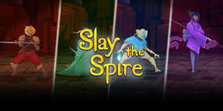
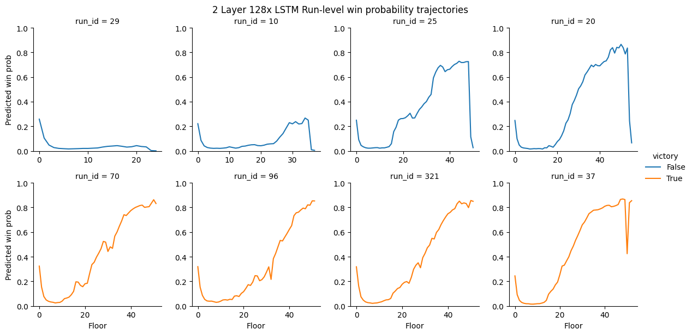

# **Slay the Spire Floor-Level Win Prediction**



This project builds a full pipeline for predicting **win probability** in *Slay the Spire* using **floor-level reconstructed data** from 126k human runs (≈3M floors).  
We model how decks evolve, how archetypes form, and how early decisions influence success.

For full methodology, experiments, and results, see the accompanying paper in `results/`.

---

## **Running Instructions**

Due to large datasets (up to 50GB of demanded CPU RAM), storing the data in Github is not possible, and running the modeling notebooks in Colab is strongly recommended. If running notebooks is necessary:

1. Reach out to me at <jmrusso@bu.edu>
2. I will share the google drive folder (mount point) containing all data and pretrained models
3. Add the google drive folder in your google drive as a shortcut (instructions provided in notebook 2)

All models and notebooks will then work out of box!

---

## **What’s Here**

- A deterministic replay system that reconstructs **exact deck and relic states** on every floor  
- High-dimensional **x-hot deck vectors** compressed into **SVD embeddings**  
- Baseline models (LogReg, MLP) and **sequential models (LSTMs)** for per-floor win prediction  
- Tools for generating **win-probability curves** across a run  

Notebooks walk through each stage:

- `1 - Transform Run-Level to Floor-Level.ipynb`  
- `2 - Card Handling.ipynb`  
- `3 - Exploratory Data Analytics.ipynb`  
- `4 - Modeling.ipynb`

By the end, we create a run-strength analyzer that can make sequential and stable predictions of run strength, successfully finding "choke points" where a run is no longer likely to win.



---

## **Key Findings (Short Version)**

- SVD deck embeddings capture meaningful archetype structure  
- Sequential models produce smoother, more accurate predictions than per-floor baselines  
- Win probability becomes reliably separable by ~Floor 35  

More detail, figures, and evaluation tables are in the [full paper PDF](./results/Sequential%20Win%20Probability%20Modeling%20in%20Slay%20The%20Spire%20Using%20Floor%20Level%20Representations%20and%20Recurrent%20Neural%20Architectures.pdf).

---

## **See Also**

- Lightning talk slides (`results/Lightning Presentation.pptx`)  
- Full academic report (`results/...Sequential Win Probability Modeling...pdf`)  

This repo is a foundation for future work on real-time run evaluation and sequence-based models for deck-building games.

--

## **Project Structure**

```
.
├── README.md
├── misc
│   ├── 2LayerLstmPreds.png
│   ├── STS-img.jpeg
│   └── asc.jpg
├── notebooks
│   ├── 1 - Transform Run-Level to Floor-Level.ipynb
│   ├── 2 - Card Handling.ipynb
│   ├── 3 - Exploratory Data Analytics.ipynb
│   └── 4 - Modeling.ipynb
├── pyproject.toml
├── results
│   ├── Lightning Presentation.pptx
│   └── Sequential Win Probability Modeling in Slay The Spire Using Floor Level Representations and Recurrent Neural Architectures.pdf
└── uv.lock
```
